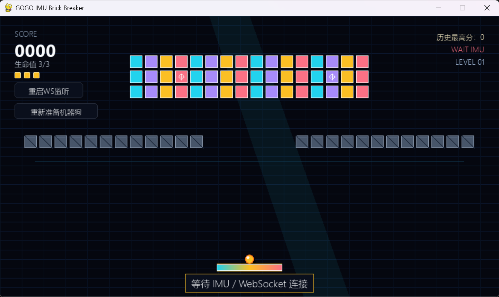
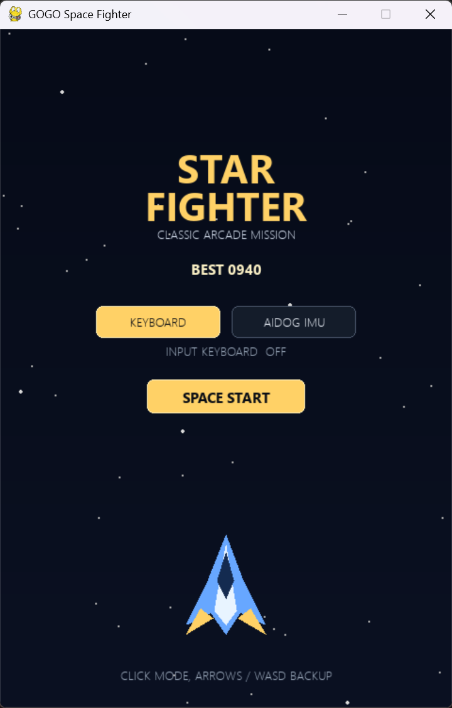

# 小游戏

`game/` 目录包含三个 PC 端 pygame 小游戏，可用于课堂演示键盘控制、IMU 体感控制和机器狗反馈。

## 游戏列表

| 游戏 | 入口脚本 | 控制方式 | 说明 |
|---|---|---|---|
| 平衡球 | `game/balance_ball/aidog_balance_ball_game.py` | 键盘、BLE IMU、WebSocket IMU | 通过倾斜机器狗保持球在横杆上。 |
| 打砖块 | `game/brick_breaker/aidog_brick_breaker_game.py` | 键盘、BLE IMU、WebSocket IMU | 通过机器狗 roll 控制挡板，击碎砖块。 |
| 星际飞机 | `game/space_fighter/aidog_space_fighter_game.py` | 键盘、WebSocket IMU | 控制战机移动、击败敌机和 BOSS。 |

## 界面预览

### 平衡球


### 打砖块



### 星际飞机



## 安装依赖

请在 `aidog_sdk` 项目根目录执行命令。

```bash
pip install -e .
pip install pygame
```

如果要使用 WebSocket IMU 控制，还需要安装 WebSocket 可选依赖：

```bash
pip install -e ".[dev_pc_ws]"
```

## 键盘试玩

键盘模式最适合先做窗口和玩法验证，不需要连接机器狗。

```bash
python game/balance_ball/aidog_balance_ball_game.py --transport keyboard
python game/brick_breaker/aidog_brick_breaker_game.py --transport keyboard
python game/space_fighter/aidog_space_fighter_game.py
```

## 机器狗 IMU 控制

固件已配置 Dev PC WebSocket 后，可以让 PC 侧监听，机器狗连入后提供 IMU 数据。

```bash
python game/balance_ball/aidog_balance_ball_game.py --transport ws --bind 0.0.0.0 --port 8766
python game/brick_breaker/aidog_brick_breaker_game.py --transport ws --bind 0.0.0.0 --port 8766
python game/space_fighter/aidog_space_fighter_game.py --imu ws --ws-bind 0.0.0.0 --ws-port 8766
```

平衡球和打砖块也支持 BLE IMU 输入：

```bash
python game/balance_ball/aidog_balance_ball_game.py --transport ble
python game/brick_breaker/aidog_brick_breaker_game.py --transport ble
```

## 常用参数

- `--bind` / `--ws-bind`：PC WebSocket 监听地址。
- `--port` / `--ws-port`：PC WebSocket 监听端口。
- `--name-prefix`：BLE 设备名前缀，默认 `Gogobot`。
- `--address`：Windows/Linux 下的 BLE 地址，或 macOS 平台 UUID。
- `--dog-facing`：机器狗朝向，取值 `user` 或 `away`，用于 roll 映射。
- `--invert-roll`：当实际方向相反时反转 roll 控制。
- `--sensitivity`：倾斜灵敏度倍率。
- `--score-file`：自定义分数 JSON 文件路径。

默认分数文件保存在 `game/scores/` 下。

## 安全说明

建议先用键盘模式确认窗口和玩法正常，再切换到机器狗 IMU 控制。IMU 玩法前请把机器狗放在平整稳定的位置；部分游戏会向机器狗发送准备姿态或反馈动作，请确认周围空间足够，姿态异常时立即退出游戏。
